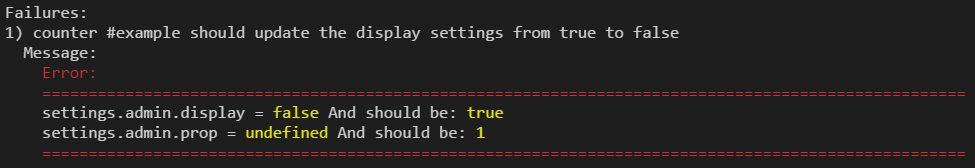

# TestReducer
A simple yet smart testing framework for your redux's reducers.

You can use whatever unit testing framework you wish.

## Getting Started
`npm install test-reducer --save-dev`

## What this is all about
A reducer is a simple function.
It gets the current state object and an action, and calculate the next state of the system.

With this framework, you can test your reducer in the following manner:

`Given` Some State

`When`  Dispatching an action

`Then`  The next state should be

The framework allows you to send only a small portion of the state, that is relevant to your test.
Moreover, if the test fails, meaning - the actual state is different from the expected one,
You will recieve the delta between the two.
For example, the 4th test in this example fails and the error is:

*It fails because I intentially expected 'true' when it should have been 'false', and also added a property named 'prop' that shouldn't be there)*



## Example
You can also find this example under examples/example.spec.js

```javascript
const TestReducer = require('test-reducer').TestReducer

describe('counter #example',() => {
    let tester;
    const state = {
        counter: 0,
        settings: {admin: {display: false, notRelevantProp: 1}, notRelevantProp: 4}
    }

    beforeEach(() => {
        tester = new TestReducer(sampleReducer, state);
    });

    it('should do nothing on an unknown action', ()=> {
        tester
            .whenActionIs({type: 'BLA'})
            .thenNoChange();
    })
    it('should add 4 to the counter', () => {
        tester
            .givenState({counter: 3})
            .whenActionIs({type: 'ADD', payload: 4})
            .thenStateIs({counter: 7});
    })
    it('should reset the counter', () => {
        tester
            .givenState({counter: 3})
            .whenActionIs({type: 'RESET'})
            .thenStateIs({counter: 0});
    })
    // This test is failing on porpuse
    it('should update the display settings from true to false', () => {
        tester
            .givenState({settings: {admin: {display: true}}})
            .whenActionIs({type: 'TOGGLE_DISPLAY'})
            .thenStateIs({settings: {admin: {display: true, prop: 1}}});
    })
})

const sampleReducer = (state, action) => {
    switch (action.type) {
        case 'ADD':
            const newCounterValue = state.counter + action.payload;
            return Object.assign({}, state, {counter: newCounterValue})
            
        case 'RESET':
            return Object.assign({}, state, {counter: 0})

        case 'TOGGLE_DISPLAY':
            const newSettings = {
                admin: {
                    display: !state.settings.admin.display, 
                    notRelevantProp: 1
                }, notRelevantProp: 4
            }
            return Object.assign({}, state, {settings: newSettings});

        default:
            return Object.assign({}, state)
    }
}
```